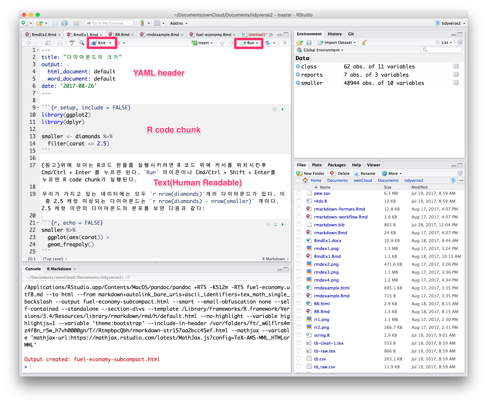
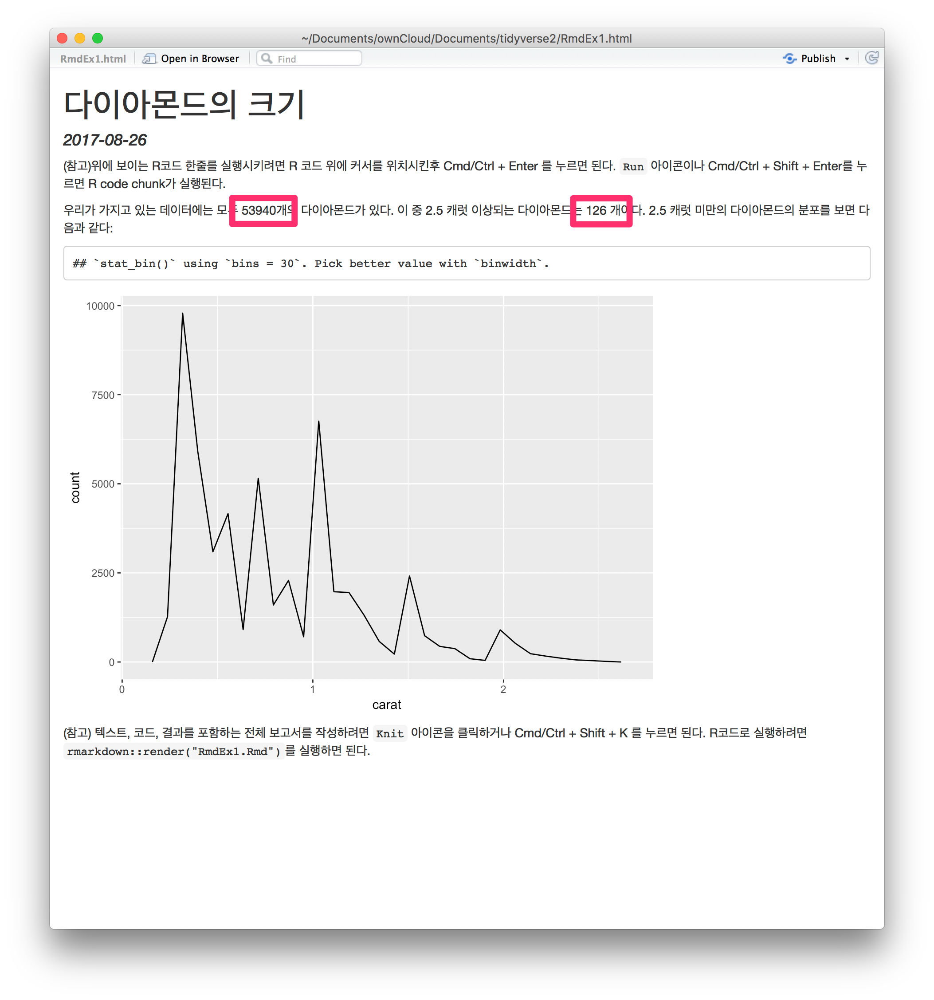
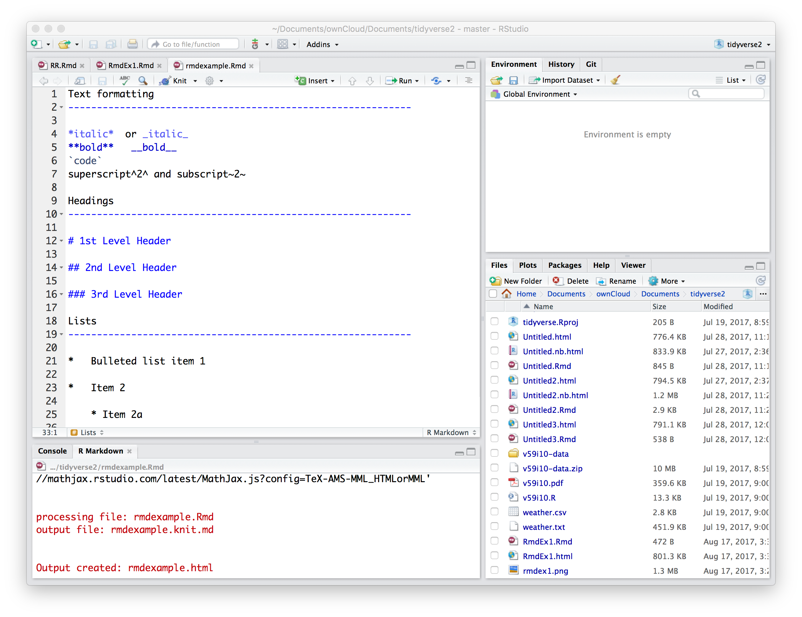
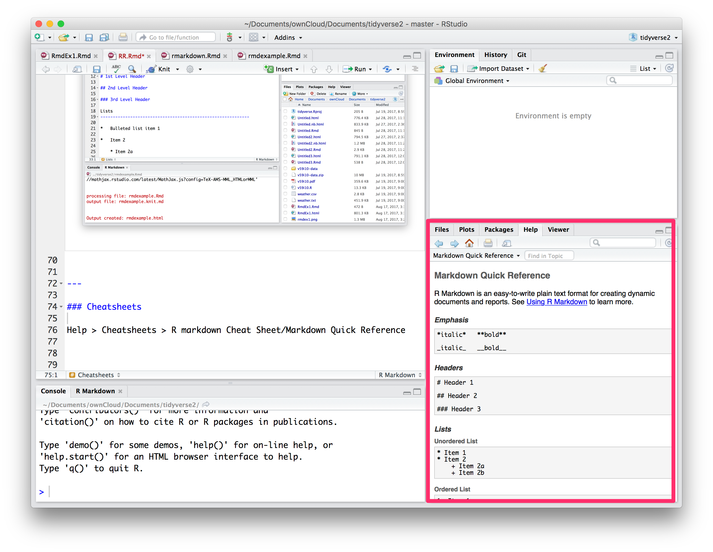
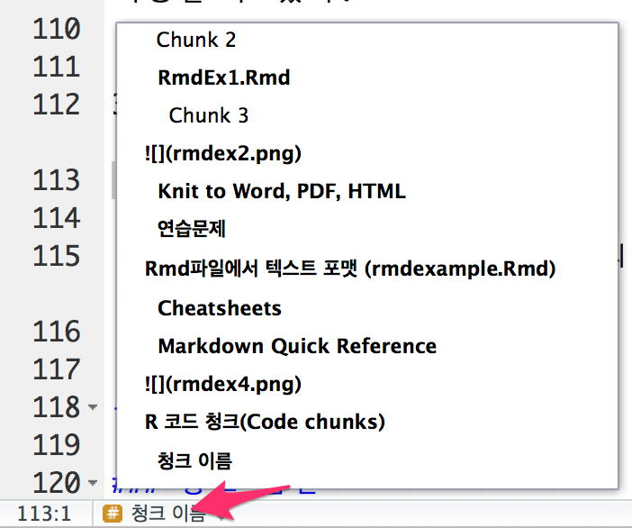
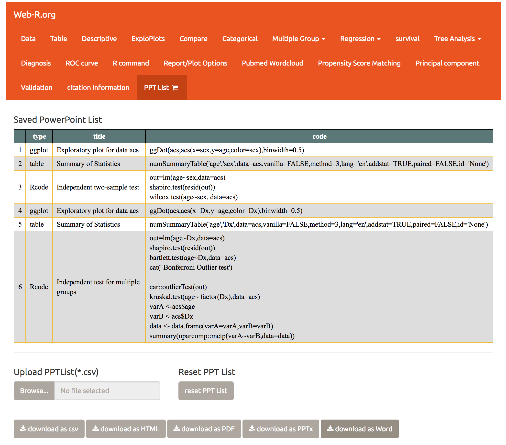

```{r setup, include=FALSE}
chunk <- "```"
pagebreak <-"---"
inline <- function(x = "") paste0("`` `r ", x, "` ``")
library(tidyverse)
options(htmltools.dir.version = FALSE)
knitr::opts_chunk$set(comment=NA,message=FALSE, collapse=TRUE)

```


## References

이 강의 슬라이드의 내용 중 많은 부분은 Hadley Wikham의  [R for Data Science](http://r4ds.had.co.nz/) 를 참조하여 만들어졌음을 밝힌다. 

```{r,out.height="300px",echo=FALSE}
knitr::include_graphics("http://r4ds.had.co.nz/cover.png")
```

---
# Work flow of your study


---
## 예제 파일 다운로드

이 강의에 사용되는 예제 파일들은 저자의 github에서 다운로드 받으실 수 있습니다.

- [https://github.com/cardiomoon/RRworkshop](https://github.com/cardiomoon/RRworkshop)

다음 예제 파일들이 사용됩니다.

- RmdEx1.Rmd

- RmdEx2.Rmd

- figureSizing.Rmd

- rmdexample.Rmd

- fuel-economy.Rmd

---
### File > Open File.. > RmdEx1.Rmd 

```{r,echo=FALSE}
cat(htmltools::includeText("RmdEx1.Rmd"))
```

---


---
## 인라인 코드(Inline code)

R markdown 문서의 text에 R 코드를 삽입할 때에는 ` `r `  코드 ` ` `  와 같이 사용한다. 

- 우리가 가지고 있는 데이터에는 모두 ` `r `  nrow(diamonds)` ` ` 개의
다이아몬드가 있다. 

- 이  중 2.5 캐럿 이상되는 다이아몬드는 ` `r `  nrow(diamonds) - nrow(smaller)` ` ` 개이다.


보고서가 만들어질 때에는 다음과 같이 계산 결과가 텍스트에 삽입된다:

- 우리가 가지고 있는 데이터에는 모두  53940개의 다이아몬드가 있다. 

- 이  중 2.5 캐럿 이상되는 다이아몬드는 126 개이다.

---


---
### Knit to Word, PDF, HTML


---

### 연습문제

1. *File > New File > R Notebook* 메뉴에서 새 Notebook 을 만들어보자. 
--

- 만들어진 Notebook을 읽어보고 R code chunk를 실행시켜보자. 
--


- 코드의 내용을 변경해보고 다시 실행시켜 output의 변화를 보자

---
## Rmd파일에서 텍스트 포맷 (rmdexample.Rmd)




---

### Cheatsheets

Help > Cheatsheets > R markdown Cheat Sheet


---
### Markdown Quick Reference

Help > Markdown Quick Reference


---

## R 코드 청크(Code chunks)

Rmd 파일에 코드 청크를 삽입하는 세가지 방법

1. 키보드 단축키: Cmd/Ctrl + Alt + I

1. 에디터 툴바의 `Insert` 버튼

1. 청크 경계기호인  ` ```{r} `과 ` ``` ` 삽입 

---

### 청크 이름

코드 청크에 *` ```{r by-name} `*과 같이 이름을 붙일 수 있다. 이름을 붙이면 다음과 같은 장점이 있다.

```{r, echo = FALSE, out.width = "20%"}
    
```

1. 에디터 왼쪽 아래의 drop-down code navigator로 코드 청크를 쉽게 찾을 수 있다.
1. 코드 청크에 의해 만들어지는 그래프에 이름이 붙기 때문에 그림을 다른 곳에서 이용할 수 있다.
1. 코드 청크에 의해 생기는 연산 결과를 캐쉬에 넣어 다른 곳에서 연산을 다시 수행하지 않고 사용할 수 있다.

---

### setup 청크

청크 이름 중 *setup*은 특별한 의미가 있다. `setup` 코드 청크는 다른 코드가 수행되기 전 한번만 수행된다.


---

### 청크 옵션

청크 헤드에 옵션을 주어 청크의 결과물을 조절할 수 있다. 약 60개의 옵션이 제공된다.(<http://yihui.name/knitr/options/>). 이 중 중요한 옵션은 다음과 같다.

- eval = FALSE

- include = FALSE

- echo = FALSE

- message = FALSE, warning =FALSE

- results = 'hide', fig.show='hide'

- error = TRUE

---
### 청크 옵션

```{r,results="asis",echo=FALSE}
Option=c("eval = FALSE","include = FALSE","echo = FALSE","results = 'hide'","fig.show = 'hide'",
         "message = FALSE","warning = FALSE")
A=c("-","","","","","","")
B=c("","-","-","","","","")
C=c("-","-","","-","","","")
D=c("-","-","","","-","","")
E=c("-","-","","","","-","")
F=c("-","-","","","","","-")

data1=data.frame(Option,A,B,C,D,E,F)
colnames(data1)=c("Option","Run code","Show code","Output","Plots","Messages","Warnings")
ztable::ztable(data1,align="cccccccc",include.rownames=FALSE,type="html")
```

---

### 테이블

디폴트로 R markdown 에서는 데이터 프레임을 콘솔에서 보는 것과 같이 인쇄해준다.

```{r}
mtcars[1:5,]
```
---
knitr::kable() 함수를 쓰면 보다 보기 좋은 표를 얻을 수 있다.

```{r,results='asis'}
knitr::kable(mtcars[1:5,], caption = "A knitr kable",format="html")
```
---
그 외에 xtable, stargazer, pander, tables, ascii 패키지 등을 이용하면 표 출력을 보다 세밀하게 조절 할 수 있다. 다음은 ztable의 예이다. 

```{r, results='asis'}
require(ztable)
ztable(mtcars[1:5,],type="html",caption = "Table: A ztable") 
```


```{r, results='asis'}
ztable(mtcars[1:5,]) %>%
  addRowColor(4,"yellow") %>%
  addColColor(5,"orange") %>%
  addCellColor(4,5,"red") %>%
  print(type="html")
```
---
```{r}
DT::datatable(mtcars[,1:5])
```

---
### Caching

- 정상적으로 Rmd 파일에서 문서가 만들어질 때 아무것도 없는 상태에서 시작한다. 

- 코드에서 모든 연산을 수행하기 때문에 재현성 측면에서 유리하다.

- 계산에 시간이 많이 걸리는 경우 *cache = TRUE* 옵션을 주면 코드청크의 결과물을 디스크에 저장했다가 코드가 바뀌지 않은 경우 결과를 다시 사용한다. 

---
### Cache 사용시 주의할 점

디폴트로 캐쉬는 dependency 에 의존하지 않는다. 예를 들어 다음 코드를 보자.

    `r chunk`{r raw_data}
    raw_data <- readr::read_csv("a_very_large_file.csv")
    `r chunk`
    
    `r chunk`{r processed_data, cache = TRUE}
    processed_data <- raw_data %>% 
      filter(!is.na(import_var)) %>% 
      mutate(new_variable = complicated_transformation(x, y, z))
    `r chunk`

processed_data 청크는 raw_data 청크에 의존한다. 하지만 이때 process_data 청크는 dplyr 파이프라인이 바뀐 경우에는 다시 수행되나 read_csv() 함수가 바뀐 경우에는 다시 수행되지 않는다. 이를 해결하기 위해서는 *dependson* 청크옵션을 사용하면 된다.

    `r chunk`{r processed_data, cache = TRUE, dependson = "raw_data"}
    processed_data <- raw_data %>% 
      filter(!is.na(import_var)) %>% 
      mutate(new_variable = complicated_transformation(x, y, z))
    `r chunk`

---
- *dependson* 청크옵션에는 의존성이 있는 모든 청크의 문자형벡터가 포함되어야 한다. 그래야만 의존성이 있는 청크들 중 하나라도 바뀐 경우 결과가 업데이트 된다. 

--


- 이 경우 `a_very_large_file.csv` 이 바뀐 경우에는 수행되지 않는다. *cache.extra* 옵션을 사용하면 파일의 변화를 추적할 수 있다. 


    `r chunk`{r raw_data, cache.extra = file.info("a_very_large_file.csv")}
    rawdata <- readr::read_csv("a_very_large_file.csv")
    `r chunk`
    
--

- 캐쉬의 사용이 점점 복잡해지다면 *knitr::clean_cache()*를 사용해 cache를 주기적으로 청소해주는 것이 좋다. 

--

- 청크의 이름을 붙일 때에는  [David Robinson](https://twitter.com/drob/status/738786604731490304)의 조언대로 그 청크에서 만들어지는 가장 중요한 객체의 이름을 따서 짓는 것을 권유한다. 그럴 경우 *dependson* 옵션을 이해하기 쉬워진다. 

---
## Global Options

디폴트 청크 옵션이 원하는 것과 맞지 않는 경우 *knitr::opts_chunks$set()* 함수를 써서 한꺼번에 바꿀 수 있다. 

```{r, eval=FALSE}
knitr::opts_chunks$set(
  comment = NA,
  collapse = TRUE,
  message = FALSE,
  warning = FALSE
)
```

만일 보고서에서 R code를 숨기고 싶은 경우에는 다음과 같이 할 수 있다.

```{r, eval=FALSE}
knitr::opts_chunks$set(
  echo = FALSE
)
```


---
### 숫자의 출력

텍스트에 숫자를 넣을 경우 format() 함수를 사용하면 소숫점 아래 자릿수나 1000단위에 맞추어 숫자를 보기 좋게 출력할 수 있다.

```{r}
comma <- function(x) format(x, digits = 2, big.mark = ",")
comma(3452345)
comma(.12358124331)
```

---
## 연습문제

1. diamonds 데이터를 사용하여 cut, colour, clarity에 따른 다이아몬드의 크기를 탐색하는 section을 추가하라. 보고서를 보는 사람이 R을 모른다는 가정하에 global option을 사용하여 R code를 출력하지 않게 하라.

2. RmdEx1.Rmd 파일 끝에 가장 큰 20개의 다이아몬드를 기술하는 섹션을 추가하라.

3. RmdEx1.Rmd 파일에 comma() 함수를 사용하여 숫자를 보기좋게 출력하고 2.5 캐럿보다 큰 다이아몬드의 백분율을 추가하라.

4. R markdown 문서를 하나 만들고 d가 b 와 c에 의존하고 b와 c는 a에 의존하는 코드청크를 만들고 각 청크에 lubridate::now() 를 출력하고 cache = TRUE 로 지정하라. 이 문서를 통해 캐쉬를 이해하고 있는지 확인하라.

---
## YAML 헤더

문서 전체의 셋팅을 조절하려면  [YAML](https://ko.wikipedia.org/wiki/YAML) 헤더의 인수를 조절하면 된다. YAML은 원래 *yet another markup language* 의 약자였으나 요즘은 *YAML Ain't Markup Language* 로 사용되고 있다. R markdown 문서에서는 출력을 세부적으로 조절하기 위해 YAML 헤더를 사용한다. 


```{r,echo=FALSE}
cat(htmltools::includeText("header.Rmd"))
```


---
### 인수(Parameters)

R 마크다운 문서에는 보고서를 출력할 때  값을 정할 수 있는 인수들을 사용할 수 있다. 인수들은 중요한 값을 달리하여 같은 보고서를 출력할 때 유용하다. 예를 들어 지점별로 판매 보고서를 출력하거나 학생별로 시험 결과를 출력할 때, 또는 나라별로 인구통계를 출력할 때 사용할 수 있다. 인수를 정의할 때는 *params* 를 사용한다.  

다음 예는 2.5 캐럿 이하의 다이아몬드의 분포를 보는 RmdEx1.Rmd 파일에서 2.5를 인수로 지정한 예이다.(RmdEx2.Rmd) 
---

```{r,echo=FALSE}
cat(htmltools::includeText("RmdEx2.Rmd"))
```
---
### 연습문제

2.5 캐럿이 아닌 3.0 캐럿 이하의 다이아몬드의 분포를 보는 문서를 작성해 보자. 
---
### 명령행에서 Rmd 파일의 인수를 지정

- 사용파일 : fuel-economy.Rmd 
---
### fuel-economy.Rmd

```{r,echo=FALSE}
cat(htmltools::includeText("fuel-economy.Rmd"))
```
---
*suv*가 아닌 *pickup* 차종에 대해 같은 보고서를 출력하려면 다음과 같이 할 수 있다.

```{r, eval=FALSE}
rmarkdown::render("fuel-economy.Rmd", params=list(my_class="pickup"))
```

mpg 데이터의 차의 종류는 다음과 같다. 

```{r}
unique(mpg$class)
```

모든 차의 종류에 대해 같은 보고서를 출력하려면 어떻게 해야 할까? 
---

```{r}
reports <- tibble(
  class = unique(mpg$class),
  filename = stringr::str_c("fuel-economy-", class, ".html"),
  params = purrr::map(class, ~ list(my_class = .))
)
reports
```
```{r, eval=FALSE}
reports %>% 
  select(output_file = filename, params) %>% 
  purrr::pwalk(rmarkdown::render, input = "fuel-economy.Rmd")
```

---

## 그림의 사용


figureSizing.Rmd

```{r,echo=FALSE}
cat(htmltools::includeText("figureSizing.Rmd"))
```

---
## 웹R의 reproducible research

```{r out.width="70%",echo=FALSE}

```


 
