```{r setup, include=FALSE}
options(htmltools.dir.version = FALSE)
```


# 내 용

- Replication ? Reproducible Research ?

- Reproducible research using RStudio


---

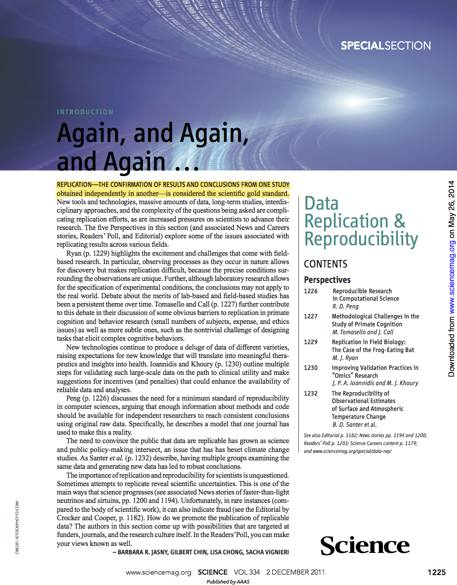


# Replication

- The Confirmation of Results and Conclusions From One Study obtained **independently** in another 

- is considered the **scientific gold stanadrd**

---
# Replication


- Replication of findings and conducting studies with **independent**
  - Investigators
  - Data
  - Analytic Methods
  - Laboratories
  - Instruments

- Replication is particularly important in studies that can impact broad policy or regulatory decisions

---
# What’s Wrong with Replication?

- Some studies cannot be replicated 
   * No time, opportunistic :  장기간 연구 
   * No money  : 대규모 무작위 - 대조군 연구
   * Unique 

- 대규모 , 장기간 연구가 아닌 경우
   * replication이 가능할까?

---
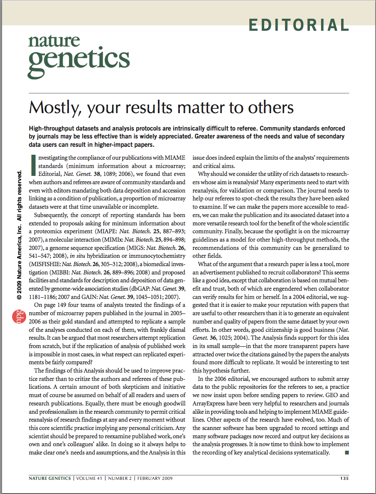

---   
# Nature genetics

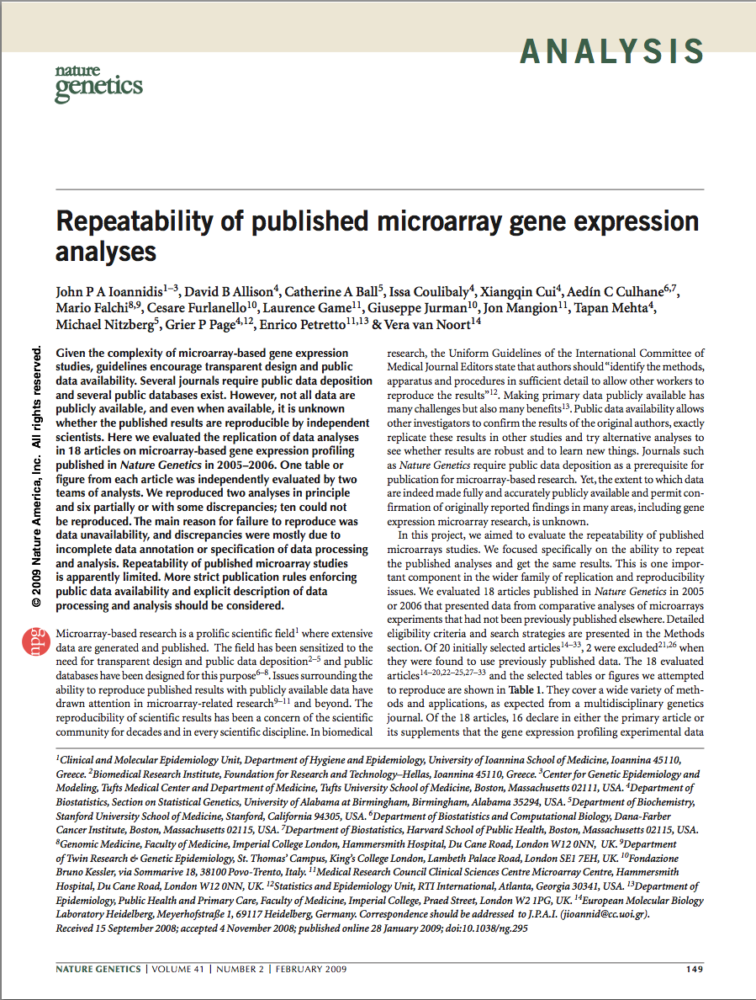

---
# Repeatability of published microarray gene expression analyses


* Selected articles published in **Nature Genetics** between January 2005 and December 2006 that had used profiling with microarrays

* Of the 56 items retrieved electronically, **20 articles** were considered potentially eligible for the project

* The four teams were from

   * University of Alabama at Birmingham(UAB)
   * Stanford/Dana-Farber(SD)
   * London(L)
   * Ioannina/Trento(IT)

* Each team was comprised of 3-6 scientists who worked together to evaluate each article.

---
# Results

* Result could be reproduced : n=2

* Reproduced with discrepancy : n=6

* Could not be reproduced : n=10

  * No data n=4 (no data n=2, subset n=1, no reporter data n=1)
  * Confusion over matching of data to analysis (n=2)
  * Specialized software required and not available (n=1)
  * Raw data available but could not be processed (n=2)

---
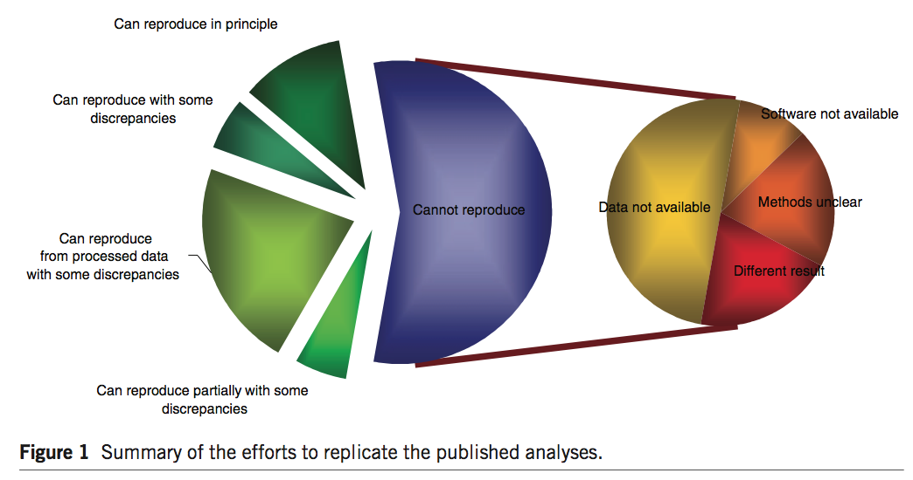


---
# How Can We Bridge the Gap

```{r,out.height="400px",out.width="200px",echo=FALSE}
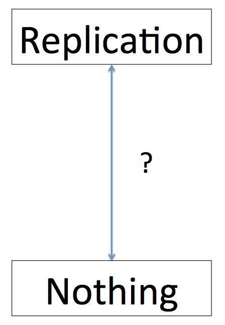
```
---
# How Can We Bridge the Gap
```{r,out.height="400px",out.width="200px",echo=FALSE}
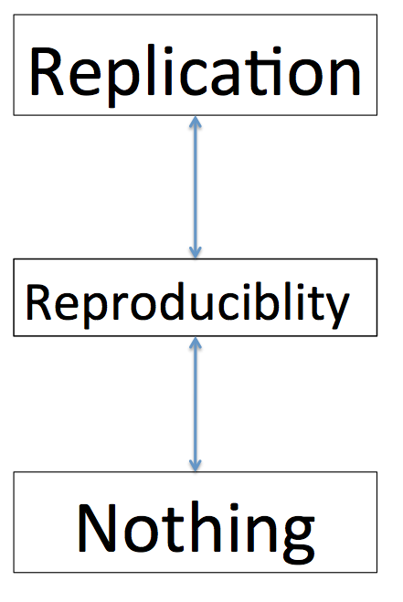
```

---
# Reproducible Research

- **data** and the **computer code** used to analyze the data be made **available** to others

- attainable **minimum** reproducibility standard

- fill the gap between full replication of a study and no replication 

---
# Why Do We Need Reproducible Research?

- New technologies increasing data collection throughput; data are more complex and extremely high dimensional

- Existing databases can be merged into new “megadatabases”

- Computing power is greatly increased, allowing more sophisticated analyses

- For every field “X” there is a field “Computational X”

---

# Research Pipeline


---
# Research Pipeline

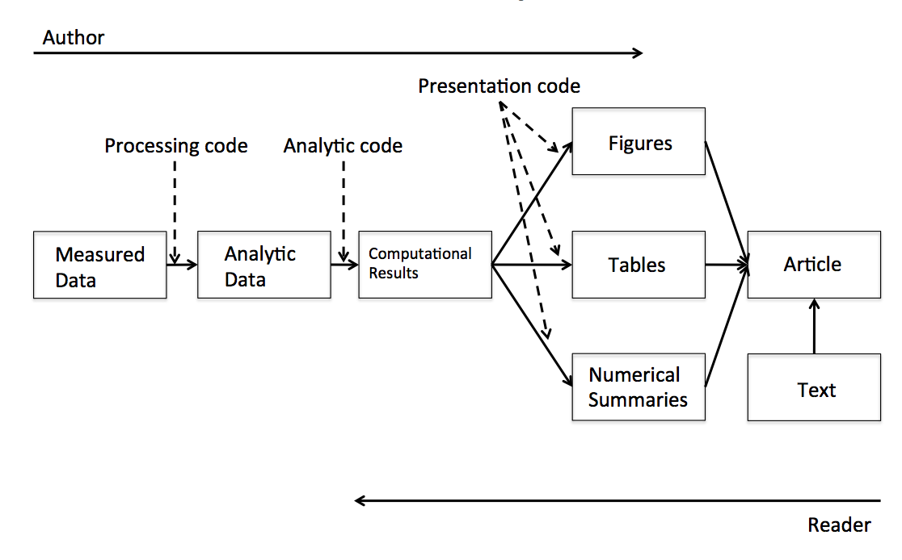
---
## Recent Developments in Reproducible Research

.pull-left[
]

.pull-right[
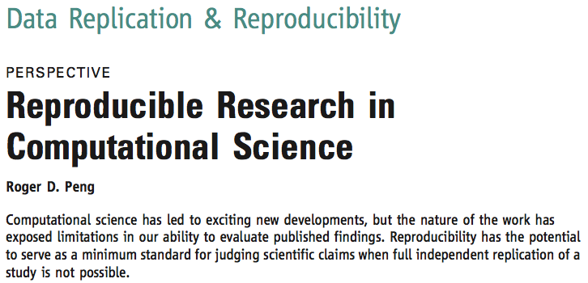]

---
## Recent Developments in Reproducible Research

[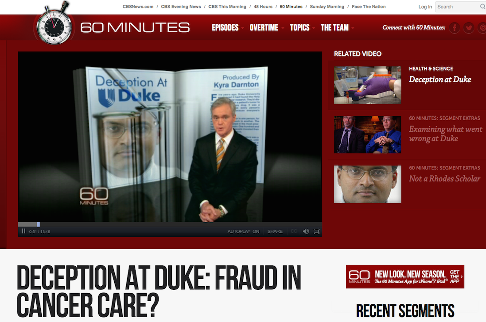](https://www.youtube.com/watch?v=W5sZTNPMQRM)

---
## Recent Developments in Reproducible Research

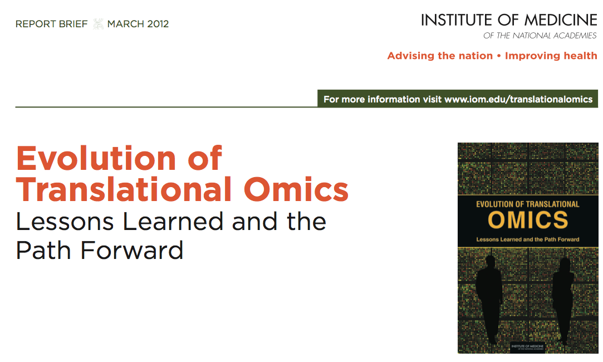
---
# Omics ??

- genomics

- transcriptomics

- proteomics

- metabolomics

---
# The IOM Report

In the Discovery/Test Validation stage of omics-based tests:	
- **Data/metadata** used to develop test should be made publicly available	

- The **computer code** and	fully specified computational procedures	used for development of	the	candidate omics-based test should be made sustainably available	

- “Ideally, the	computer code that is released will **encompass all of the steps of computational analysis**, including all data preprocessing steps,	that have been described in	this chapter. All aspects of the analysis need to be transparently reported.”	


---

# Reproducible research


- Literate Programing (문학적 프로그래밍)

- Reproducible Research (재현가능한 연구)

---

# When issues of reproducibility arise

- "Remember that microarray analysis you did **six months ago**?   
We ran a few more arrays.   
Can you add them to the project and repeat the same analysis?"

- "The statistical analyst who looked at the data I generated previously is **no longer available**.  
   Can you get someone else to analyze my new data set using the same methods 
   (and thus producing a report I can expect to understand)"

- "Please write/edit the methods sections for the abstract/paper/grant proposal I am submitting based on the **analysis you did several months ago.**"


---

# Typical workflow of many research projects


- First have an idea 

- e.g. stopping distance correlate with speed ?

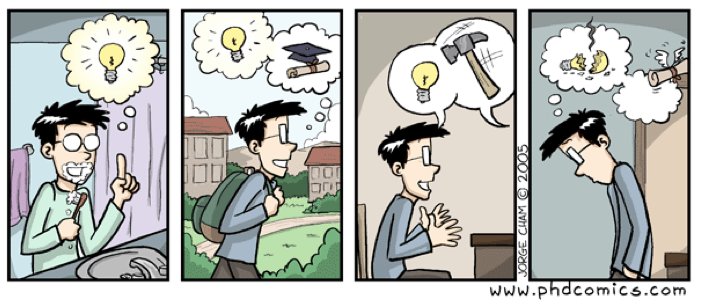
---

# 1. Prepare data(Excel/Numbers)

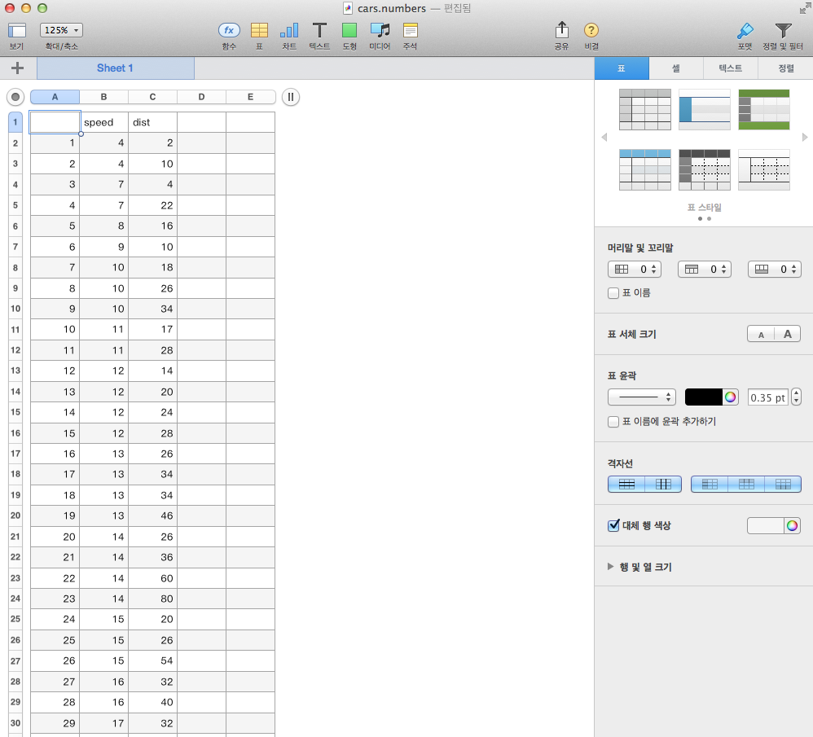

---
# 2. Do Some analysis(R/SPSS/SAS)

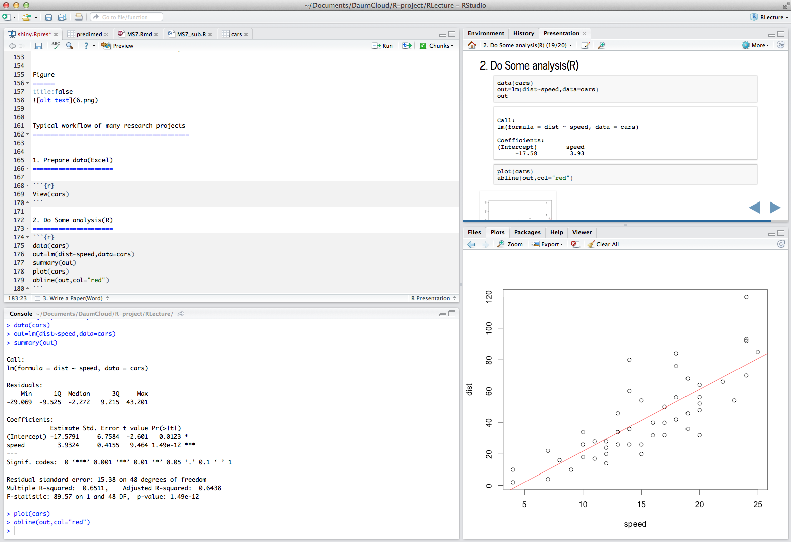
---
# 3. Write a report/paper(Word?Pages)

.pull-left[
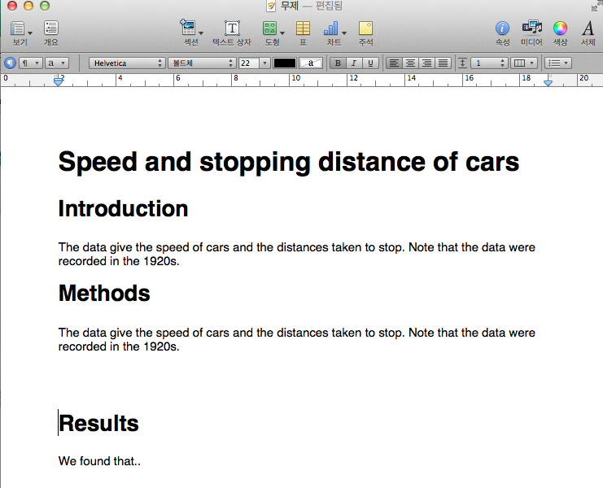]

.pull-right[
All results(figures, tables) **manually** imported to Word]

---
## This workflow is BROKEN

1. Collect and manage data(EXCEL) 

2. Analysis (R/SPSS)

3. Writeup(WORD)

---

## Problems brought by the broken workflow

.pull-left[
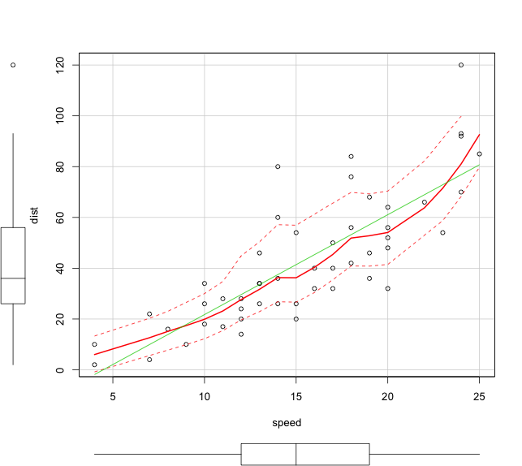]
.pull-right[

- **What analysis** is behind this figure? Did you account for [ooo] in the analysis?

- **What dataset** was used (e.g. final vs preliminary dataset)?

- Oops, there is **an error** in the data. Can you **repeat** the analysis? And update figures/tables in Word!

- As a coauthor/reader, I'd like to see the **whole research process** (how you arrived to that conclusion), rather than cooked manuscript with inserted tables/figures.
]

---

## RStudio allows us to fix the disconnect


### Integrating

- Data management 

- Data analysis

- Writing up results

in a single dynamic document

### Reproducible research !!

---
# Let's make our project reproducible

.pull-left[
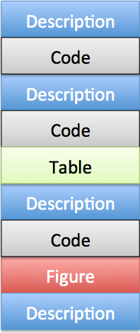]

.pull-right[
- In literate programming, an analytical document is composed of a descriptive narrative “woven” together with software code and computed results.

- Advantages
  * A single document both describes and performs the analysis
  * Enforces reproducibility
  ]
  
---    

# Conversion to word or pdf : With PANDOC

.pull-left[
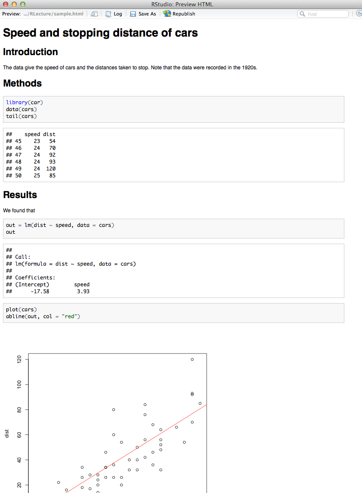]
.pull-right[
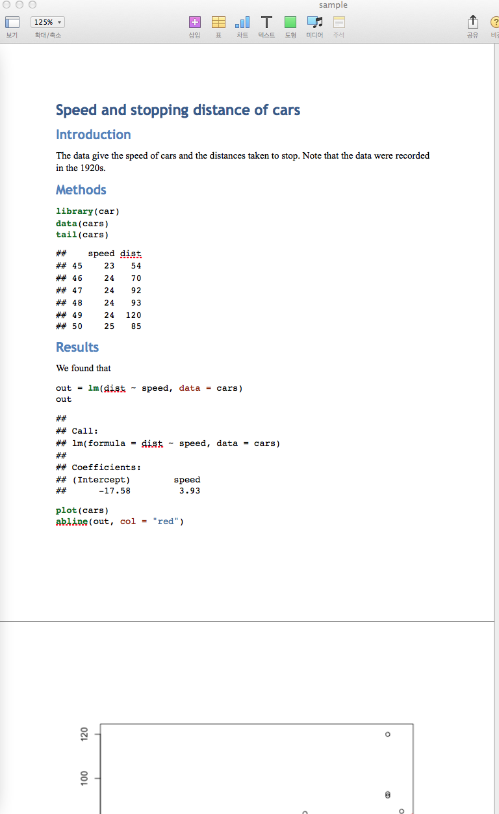]

---
# If error

- If spotting eror in data, or using different dataset...

- make changes in Rmarkdown and report will update **automatically**

---
# So... Main Advantages

.pull-left[
]

.pull-right[

- Data management fully documented (no more manual changes in Excel!)

- Analysis fully documented

- Automated reports

- can publish via Rpubs.com : http://www.rpubs.com/cardiomoon/19541

- can share the project
]
	
---
# Summary    

- Reproducible research	is important as	a **minimum standard**,	particularly for studies that are	difficult	to replicate	

- Infrastructure is	needed for **creating**	and **distributing** reproducible documents, beyond what is currently available	

- There	is a growing number of tools for creating reproducible documents	

---
# 참고자료

* [의학논문작성을 위한 R통계와 그래프](http://www.aladin.co.kr/shop/wproduct.aspx?ISBN=8955661797)

* [R과 knitr를 활용한 데이타 연동형 문서 만들기](http://www.aladin.co.kr/shop/wproduct.aspx?ISBN=8960775517)

---
## Online Resources

* [www.rstudio.com](http://www.rstudio.com)

* [Web-R.org](http://web-r.org)

## 온라인교육프로그램

* [Coursera : Reproducible Research (Jones Hopkins University)](http://www.cousera.org)


