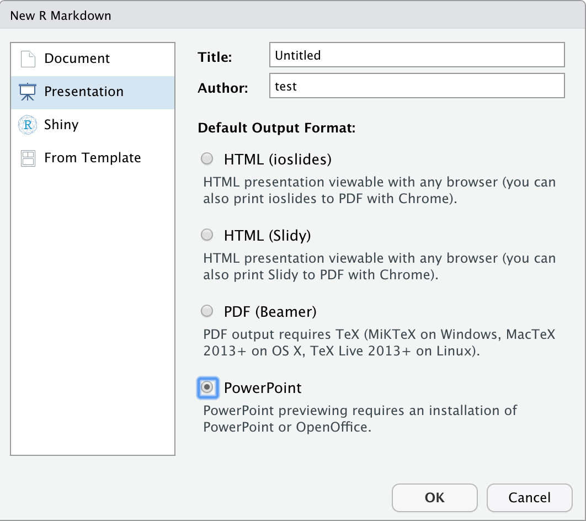

```{r setup, include=FALSE}
chunk <- "```"
pagebreak <-"---"
inline <- function(x = "") paste0("`` `r ", x, "` ``")
library(tidyverse)
options(htmltools.dir.version = FALSE)
knitr::opts_chunk$set(echo = TRUE,message=FALSE,comment=NA,fig.align="center")
```

## 필요한 패키지들

```{r, eval=FALSE}
install.packages(c("ggplot2","export",
                   "ztable","flextable","predict3d")) 
```

---

## R의 결과를 powerpoint로 만드는 두 가지 방법 

1. R markdown 문서로 만드는 방법

2. export 패키지를 이용하는 방법

---
## File > New File > R Markdown.. 


```{r,echo=FALSE,fig.width=6,fig.asp=0.618,out.width="50%"}
library(knitr)

```

---
## File > Open File.. > RmdEx3.Rmd 

```{r,echo=FALSE,fig.width=6,fig.asp=0.618,out.width="70%"}
cat(htmltools::includeText("RmdEx3.Rmd"))
```

---
## export 패키지를 이용하는 방법

```{r,eval=FALSE}
library(export)
?graph2ppt
?table2ppt
```

---
## R의 그래프를 ppt로

```{r,fig.width=7,fig.height=5}
library(ggplot2)
p<-ggplot(mtcars,aes(x=wt,y=mpg))+geom_point()+stat_smooth()
p
```

---
## export to Powerpoint      
```{r,eval=FALSE}
graph2ppt(p)      
graph2ppt(p,file="ggplot2_plot.pptx", aspectr=1.7)
```
- add 2nd slide with same graph 9 inches wide and A4 aspect ratio
```{r,eval=FALSE}
graph2ppt(p,file="ggplot2_plot.pptx", width=9, aspectr=sqrt(2), 
          append=TRUE) 
```

- add 3d slide with same graph with fixed width & height
```{r,eval=FALSE}
graph2ppt(p,file="ggplot2_plot.pptx", width=6, height=5, 
          append=TRUE) 
```
- export to Word
```{r,eval=FALSE}
graph2doc(p)
```

---
# export to bitmap or vector formats
```{r,eval=FALSE}
graph2svg(p)
graph2png(p)
graph2tif(p)
graph2jpg(p)
```

